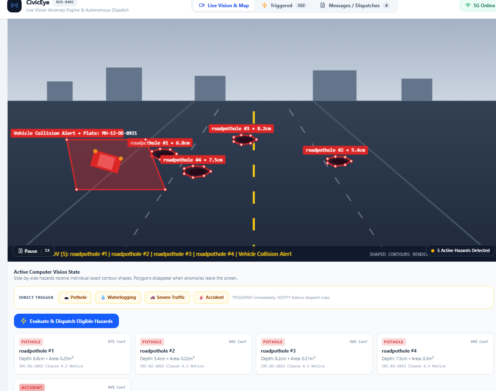
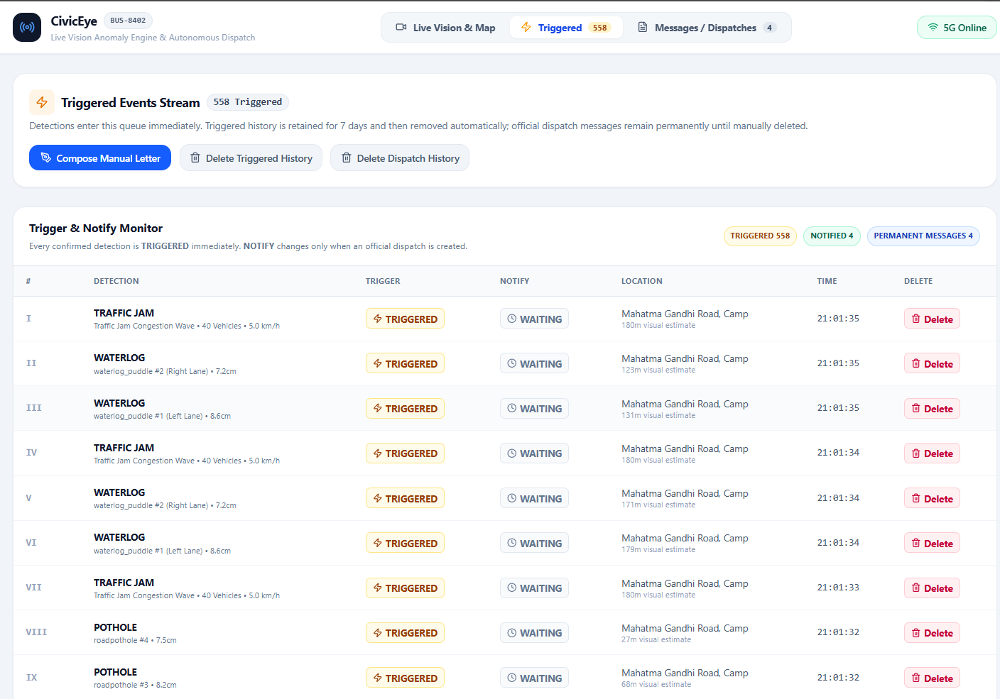
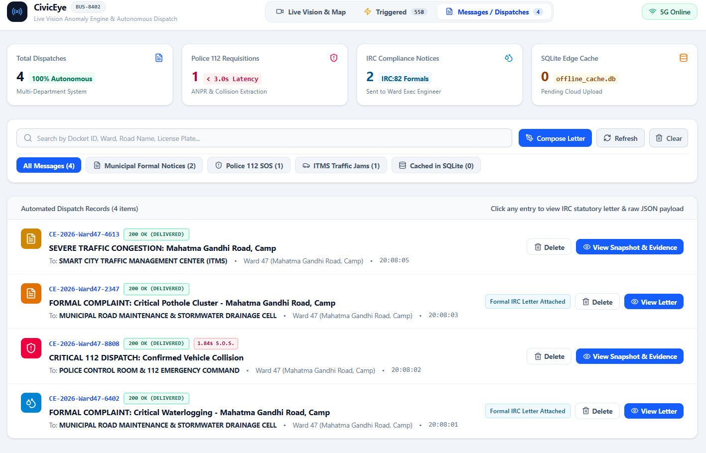
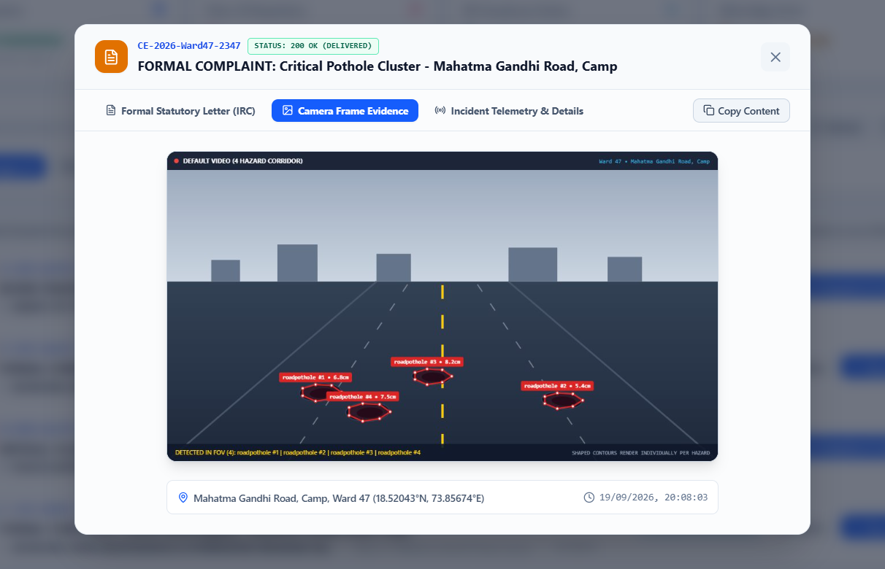
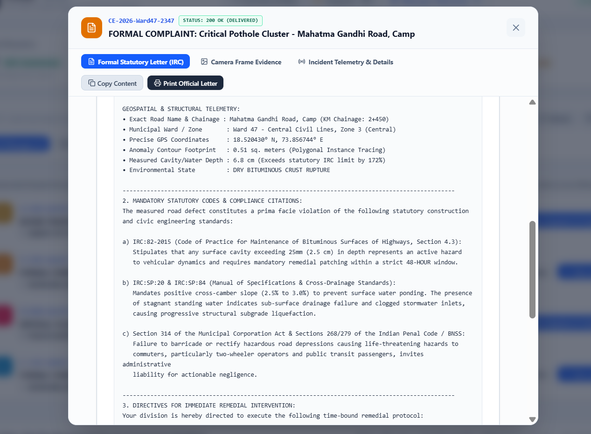
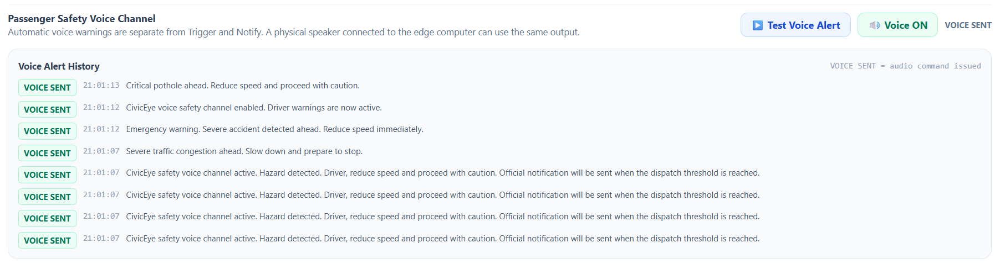
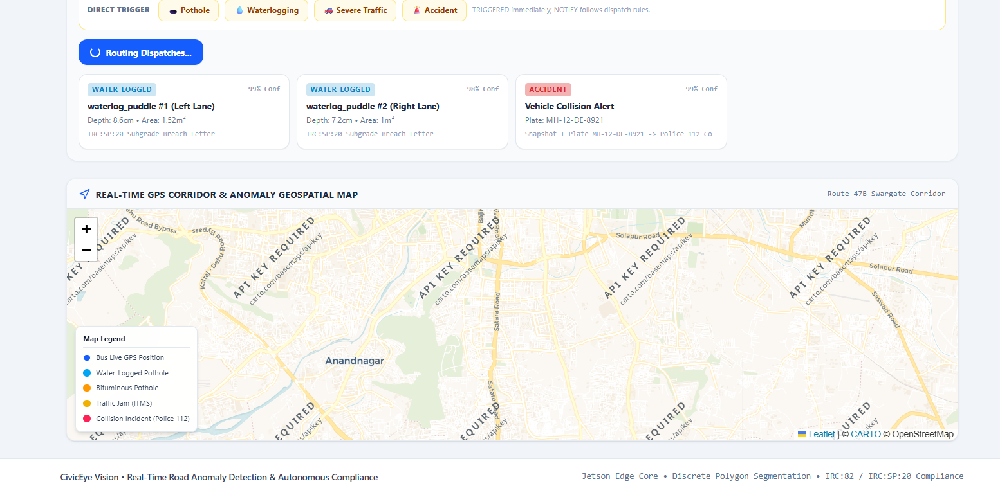

<div align="center">

# 🚍 CivicEye

### AI-Powered Mobile Urban Intelligence Platform

**Turning public transport buses into mobile urban intelligence units.**

🏆 **Smart India Hackathon 2026 — PS 26124**
👥 **Team: Innovexal**

</div>

---

## 💡 What is CivicEye?

**CivicEye uses cameras mounted on public transport buses to detect road hazards and urban incidents while the bus is moving.**

Instead of relying only on manual inspections or citizen complaints, buses become **mobile road-monitoring units**.

### 🔄 How It Works

**🚌 Bus Camera → 🤖 AI Detection → 📍 GPS → 🗄️ Backend → 🖥️ Dashboard → 🏛️ Municipal Action**

---

## 🎯 Problems We Address

* 🕳️ Potholes & damaged roads
* 💧 Waterlogging
* 🚨 Road accidents
* 🚦 Traffic congestion
* 📍 Difficult-to-identify incident locations
* ⏳ Delayed reporting
* 🔁 Duplicate complaints

---

## 🚀 Key Features

| Feature                    | Description                                                            |
| -------------------------- | ---------------------------------------------------------------------- |
| 🤖 **AI Detection**        | Detects road hazards and urban incidents from video                    |
| 🕳️ **Pothole Detection**  | Identifies and records potholes and waterlogged areas                  |
| 📍 **GPS Localization**    | Associates incidents with location, timestamp and bus/area information |
| 📸 **Visual Evidence**     | Stores detection snapshots for verification                            |
| ⚡ **Triggered Incidents**  | Records AI-detected events for processing                              |
| 📩 **Municipal Messages**  | Passes qualifying incidents for municipal action                       |
| 🔊 **Driver Voice Alerts** | Warns the driver about major/critical hazards                          |
| 🗺️ **GIS Dashboard**      | Visualizes incidents for urban monitoring                              |

---

## 🧠 AI Pipeline

```text
Video
  ↓
Frame Processing
  ↓
YOLO + OpenCV
  ↓
Hazard Detection
  ↓
Severity & Spatial Filtering
  ↓
Incident Record
  ↓
Dashboard / Alert
```

---

## 📊 Incident Management

CivicEye separates:

**Triggered Incidents**
AI-detected events entering the processing workflow.

**Messages Passed**
Events meeting configured conditions for municipal action.

This helps reduce **unnecessary and duplicate municipal notifications**.

---

## 🛠️ Technology Stack

**Frontend:** React + TypeScript
**Backend:** Node.js + TSX
**AI / Computer Vision:** YOLO + OpenCV
**Database / Cache:** SQLite
**Real-Time:** WebSocket
**Development:** Vite
**Version Control:** Git + GitHub

---

## 📸 Project Screenshots

### 1. 🖥️ Dashboard



### 2. ⚡ Triggered Incidents



### 3. 📩 Messages Passed



### 4. 🚧 Pothole Detection, Snapshot & Dispatch



### 5. 📝 Municipal Complaint Letter



### 6. 🔊 Voice Alert



### 7. 📍 GIS Location



---

## 📁 Project Structure

```text
CivicEye/
├── src/
├── assets/
├── server.ts
├── package.json
├── README.md
└── ...
```

---

## ⚙️ Run Locally

```bash
git clone https://github.com/Tejaswi-bot-ai/CivicEye.git
cd CivicEye
npm install
npm run dev
```

Open the local address shown by the development server.

---

## 🔗 Repository

**GitHub:**
[CivicEye — Source Code & Documentation](https://github.com/Tejaswi-bot-ai/CivicEye.git)

---

## 🔮 Future Scope

* 🚌 Multi-bus fleet deployment
* 🗺️ Advanced GIS analytics
* 🤖 Improved detection accuracy
* 🏛️ Automated department-wise routing
* 📊 Predictive road maintenance
* ☁️ Cloud fleet management
* 📡 Low-connectivity operation

---

<div align="center">

### 🚍 Innovexal

**Smart India Hackathon 2026**

*Building technology for safer, smarter and more responsive cities.*

</div>
